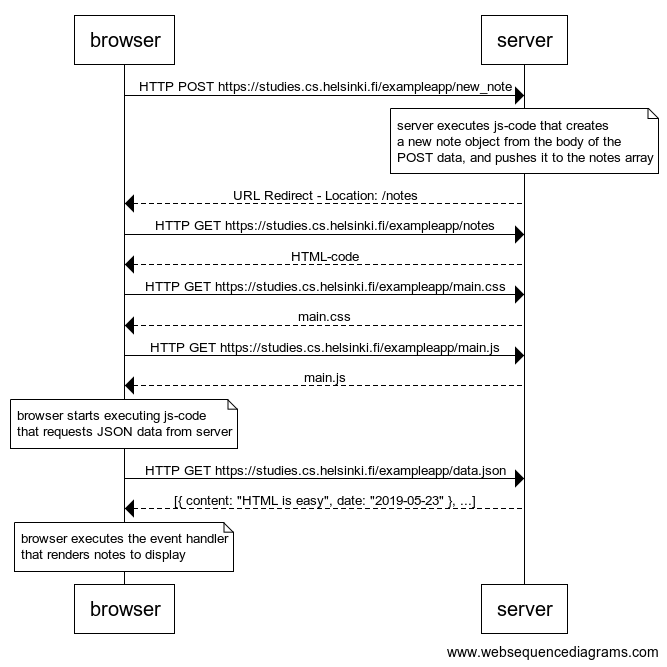
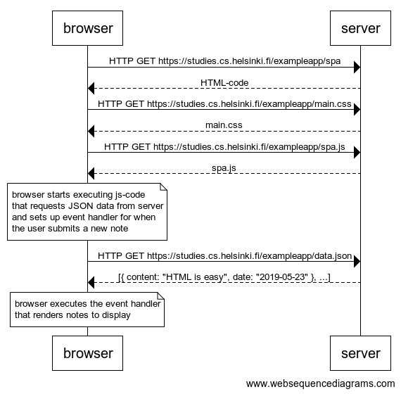
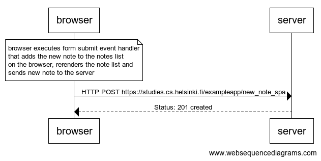

# Full Stack open 2021

## Part 0 - [Fundamentals of Web apps](https://fullstackopen.com/en/part0)

### 0.4 New Note
Diagram depicts communications where a user creates a new note on a traditional web page: https://studies.cs.helsinki.fi/exampleapp/notes.

### 0.5 Single Page App
Diagram depicts a situation where the user visits the single page app version of the notes app: https://studies.cs.helsinki.fi/exampleapp/spa.

### 0.6 New Note
Diagram depicts the situation where the user creates a new note using the single page version of the app.
